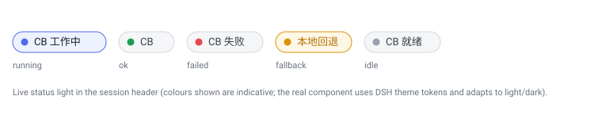

# codebuddy-first-bridge

**简体中文** · [English](README.en.md)

> 一个用于 **DeepSeek Harness (DSH)** 的 Cordis 插件：把编码/构建/调试/排查等实际工作**优先派发给本机的 `codebuddy` CLI**（腾讯 CodeBuddy Code），DSH 全程掌控 codebuddy（`--permission-mode bypassPermissions`，codebuddy 全程无提示），并在 **codebuddy 流量受限 / 网络不通** 时弹窗让用户选择是否回退到 **DSH 本地 API 配置**；同时在会话标题栏提供一个 **实时状态灯**，清晰显示 codebuddy 是否正在工作。



---

## 这是什么

`codebuddy-first-bridge` 给运行中的 DSH 会话注入两样东西：

1. **三个模型工具** —— `codebuddy_run`、`codebuddy_continue` 与 `codebuddy_status`，把任务转交给本机 `codebuddy` CLI 执行；
2. **一段 codebuddy 优先策略提示** —— 让模型在**所有模式**（普通 / plan / accept-edits / 子代理 / workflow / ralph / goal 轮次）下都优先调用 codebuddy 做实际工作，原生工具只用于只读查询和最终验证。

在此基础上，本插件还实现了用户要求的几项关键能力：

- **回退机制（弹窗确认）**：当 codebuddy 疑似被限流或网络不通时，自动弹出确认框，让用户选择「使用 DSH 本地 API 配置（回退）」/「重试 codebuddy 一次」/「不回退」。
- **实时状态灯（按项目，随软件启动）**：浏览器会话标题栏右侧的彩色指示灯**为每个项目（工作目录）分别显示一盏**，随该项目 codebuddy 活动实时变化（工作中 / 成功 / 失败 / 本地回退），悬停可查看该项目**当前正在执行的步骤**。状态灯是**家级插件**（[`home-plugin/codebuddy-indicator/`](home-plugin/codebuddy-indicator/)，经 `cordis.patch.yml` 注册），随 DSH 启动自动加载、所有会话自动显示、无需审批。
- **实时观察与用量统计（codebuddy_status）**：`codebuddy_status` 工具随时返回各项目 codebuddy 此刻在干什么 —— 每个项目当前步骤（工具名 + 参数或思考/打字中）、最近步骤轨迹、最近完成运行，以及**按项目累计的调用次数（runs）与 token 用量（totalTokens）**（codebuddy 无套餐额度 API，以 token 计量作替代观察）。支持 `cwd` 参数只看某个项目。运行中即可调用，无需等待结束。

## 四种形态

同一套逻辑提供四种落地形态，按需选择：

| 形态 | 位置 | 能力 | 是否随进程重启保留 | 状态灯 |
| --- | --- | --- | --- | --- |
| **持久 Agent Preset**（DSH 内推荐） | [`preset/codebuddy-first/`](preset/codebuddy-first/) | 工具 + 优先策略 + 回退弹窗 + `codebuddy_status` + 双后端（codebuddy/workbuddy） | ✅ 是（落盘为 preset） | ❌ 无（Host 面组合不含浏览器 UI） |
| **家级状态灯插件**（随软件启动） | [`home-plugin/codebuddy-indicator/`](home-plugin/codebuddy-indicator/) | 状态灯（所有会话自动显示，无需审批） | ✅ 是（cordis.patch.yml 注册） | ✅ 有 |
| **动态 Cordis 插件**（当前会话） | [`dynamic/`](dynamic/) | 工具 + 优先策略 + 回退弹窗 + **状态灯** + `codebuddy_status` + 双后端 | ❌ 否（进程内临时） | ✅ 有（需一次性审批） |
| **MCP 服务器**（任何 MCP 宿主） | [`mcp/`](mcp/) | `codebuddy_run` / `codebuddy_continue` / `codebuddy_status` 通过 `tools/list` 被 Claude Code、Codex、Cherry Studio 等**自动发现**，由宿主代理自主决定是否调用；支持双后端 | ✅ 是（注册进客户端配置） | ❌ 无 |

> **状态灯为什么需要家级插件？** Agent Preset 是 **Host 面** 组合（`agent.cordis.yml` 挂载 Host 插件），其中的 `.mjs` 只在 Node 侧运行，天然不含浏览器 UI；而实时状态灯是 **Client 面**（浏览器 Slot）组件。**家级插件**（`cordis.patch.yml` 注册，如 `home-plugin/codebuddy-indicator/`）同时提供 Host 半（收集各会话推送的 codebuddy 状态 + HTTP 路由）与 Client 半（浏览器轮询渲染），随 DSH 启动自动加载、所有会话自动显示、无需审批。动态插件形态（首次运行需 GUI 一次性审批）与家级形态的灯可并存：两种形态都把快照汇入家级收集器（动态形态经 `codebuddyCollector.mergeSnapshot`，preset 形态经 `ctx.emit('codebuddy/status')` 事件）。
>
> 回退弹窗是 Host 侧能力，preset 与动态两种形态都具备；MCP 形态没有 UI，限流时改为在结果文本中附加「勿循环重试」提示，由调用方代理决定回退。

详见 [docs/ARCHITECTURE.md](docs/ARCHITECTURE.md)。

## 快速开始

### 方式 A：作为持久 Agent Preset 安装（推荐）

把 `preset/codebuddy-first/` 整个目录复制到你的 DSH 用户 preset 根目录下：

```
${DSH_HOME:-$HOME/.dsh}/.agent-presets/codebuddy-first/
```

Windows 示例（本仓库开发环境）：

```powershell
Copy-Item -Recurse .\preset\codebuddy-first "$env:DSH_HOME\.agent-presets\codebuddy-first"
```

然后新开一个 DSH 会话，选择名为 **`CodeBuddy-First 执行代理`**（id：`codebuddy-first`）的 preset 即可。它继承 `standard` preset 的全部能力，额外提供 `codebuddy_run` / `codebuddy_continue` / `codebuddy_status` 工具、codebuddy 优先策略与限流/网络回退弹窗。

> ⚠️ **不要**编辑随部署一起发行的 `agent-presets` 安装目录（升级会覆盖）。始终安装到用户 preset 根目录下的独立子目录。

完整步骤与校验方法见 [docs/INSTALL.md](docs/INSTALL.md)。

### 方式 B：安装家级状态灯插件（随软件启动、所有会话可见）

把 [`home-plugin/codebuddy-indicator/`](home-plugin/codebuddy-indicator/) 复制到 DSH 家级插件目录并注册到 `cordis.patch.yml`，状态灯即随 DSH 启动自动加载、所有会话自动显示、无需审批：

```powershell
# 1) 复制插件源码
$dshHome = "$env:APPDATA\DSH Desktop\dsh-home"
Copy-Item -Recurse .\home-plugin\codebuddy-indicator "$dshHome\plugins\codebuddy-indicator"

# 2) 建 junction（host 解析与浏览器花名册都需要；共 3 条）
New-Item -ItemType Junction -Path "$dshHome\node_modules\codebuddy-indicator" -Target "$dshHome\plugins\codebuddy-indicator"
New-Item -ItemType Junction -Path "$dshHome\profiles\node_modules\codebuddy-indicator" -Target "$dshHome\plugins\codebuddy-indicator"
New-Item -ItemType Junction -Path "$dshHome\profiles\web\node_modules\codebuddy-indicator" -Target "$dshHome\plugins\codebuddy-indicator"

# 3) 在 cordis.patch.yml 末尾追加两行（HMR 自动热载，无需重启）：
#    - insert:
#        - id: codebuddy-indicator
#          name: file:///.../plugins/codebuddy-indicator/lib/index.mjs?v=1
#    - insert:
#        - id: codebuddy-indicator-client
#          name: codebuddy-indicator
```

配合 **preset 形态**（方式 A）使用：preset 里的 `codebuddy-first-bridge.mjs` 每次状态变化会 `ctx.emit('codebuddy/status')` 推送到家级收集器，灯随之实时更新；改 `lib/index.mjs` 后 bump `?v=N` 即热载，改 `lib/client.js` 后刷新浏览器即生效。

### 方式 C：作为动态 Cordis 插件运行（含状态灯）

在一个已加载 Cordis 能力的 DSH 会话里，用 `cordis_define` + `cordis_run` 定义并激活插件，Host 半用 [`dynamic/host.js`](dynamic/host.js)，Client 半用 [`dynamic/client.js`](dynamic/client.js)。首次运行 Client 半时，DSH GUI 会请求一次性审批，批准后状态灯即出现在会话标题栏。

### 方式 D：作为 MCP 服务器注册（任何 MCP 宿主可发现）

不需要 DSH 时，把 [`mcp/codebuddy-mcp-server.mjs`](mcp/codebuddy-mcp-server.mjs) 注册为 MCP 服务器，Claude Code / Codex / Cherry Studio 等宿主即可通过 `tools/list` 自动发现 `codebuddy_run` / `codebuddy_continue` / `codebuddy_status` 并自主决定调用：

```bash
# Claude Code 示例（路径换成你本机的仓库位置）
claude mcp add codebuddy -- node "<repo>/mcp/codebuddy-mcp-server.mjs"
```

Codex / 通用 JSON 配置、环境变量与自检见 [`mcp/README.md`](mcp/README.md)。

## 依赖前提

- **DeepSeek Harness (DSH)**，且会话已挂载所需 Host 服务：`tools`、`subprocess`、`systemPrompt`、`timer`（可选 `jobs`、`planMode`、`sandboxPolicy`、`userQuestions`）。
- 本机已安装 **`codebuddy` CLI**（CodeBuddy Code，`npm i -g @tencent-ai/codebuddy-code`；开发时验证版本 v2.143.0）。**不要求在 PATH 里**：桥接会依次尝试 `subprocess.resolveExecutable('codebuddy')` → `node + CODEBUDDY_BIN` → `node + %APPDATA%\npm\node_modules\@tencent-ai\codebuddy-code\bin\codebuddy`，npm 全局安装即可被找到。
- **可选**：腾讯 **WorkBuddy 桌面版**（办公任务 `backend="workbuddy"` 派发用；CLI 随桌面版安装于 `C:\Program Files\WorkBuddy\resources\app.asar.unpacked\cli\bin\codebuddy`，可用 `WORKBUDDY_BIN` 覆盖）。未安装时该后端返回带安装指引的错误，codebuddy 默认后端不受影响。
- 状态灯还需 DSH 的 Web GUI（Client 面）。

## 工具用法

`codebuddy_run(prompt, mode?, model?, effort?, maxTurns?, cwd?, addDirs?, timeoutSec?, background?, backend?)`

- `backend`：**双后端选择**（v1.1.0）。`codebuddy`（默认，CodeBuddy Code，编码场景）或 `workbuddy`（腾讯 WorkBuddy——CodeBuddy 的同引擎孪生产品，主打办公场景：文档/幻灯/表格、知识库、图片视频生成、微信/企微回复）。两者各自维护独立会话存储；`codebuddy_continue` 续接时按 sessionId **自动路由回所属后端**，显式传 `backend` 最优先。
- `mode`：`auto`（默认，跟随 DSH plan 状态自动选 `plan`/`accept-edits`）、`plan`、`accept-edits`。
- `model`：可选，指定模型（如 `hy4-preview`（默认）、`hy3`、`glm-5.3`、`kimi-k3-1`、`deepseek-v4-pro` 等，完整清单见工具描述）；不传用 CLI 配置的默认模型。`effort`：`minimal / low / medium / high / xhigh / max`；`maxTurns`（1-500，默认不限）可选。
- `background: true`：作为后台任务运行，立即返回 `jobId`，用 `job_output` 收结果；后台路径同样有 `timeoutSec+60s` 挂起守卫。
- 返回：`{ ok, status, response, sessionId, durationSeconds, numTurns, totalTokens, exitCode, mode, backend, stderr }`；回退时为 `{ ok:false, fallback:true, status:'FALLBACK_TO_DSH', ... }`。

`codebuddy_continue(prompt, sessionId? | latest?, ...)` —— 复用某个会话上下文继续对话（`--resume <sessionId>` / `--continue`），其余参数同上；不带 `backend` 时按 sessionId 自动路由到该会话所属的 CLI。

`codebuddy_status(cwd?)` —— **实时观察 + 用量统计**：返回各项目 codebuddy 此刻在干什么（`{ state, running, current, trail, lastStatus, lastSessionId, runs, totalTokens, updatedAt, projects[] }`）。`projects[]` 按项目（工作目录）分节：`current` 为该项目当前正在执行的步骤（工具名 + 参数，或 thinking/typing 思考/打字中），`trail` 为最近步骤轨迹，`runs`/`totalTokens` 为**按项目累计的调用次数与 token 用量**（codebuddy 无套餐额度 API，以 token 计量作替代观察）。可选 `cwd` 只查某个项目。`codebuddy_run`/`codebuddy_continue` 运行期间即可调用，无需等待结束。

## DSH 完全控制 codebuddy

每次调用 codebuddy 都强制带 `-p`、`--output-format stream-json` 与 `--permission-mode bypassPermissions`（plan 模式则 `--permission-mode plan`），因此 **codebuddy 从不弹权限提示，改文件也不询问**；模式、模型、effort、工作目录、超时、是否后台、能否中止全部由 DSH 侧决定，可通过 `exec.signal` + `handle.terminate()` 取消。codebuddy 无 `--print-timeout`，超时由 DSH 侧挂起守卫兜底（`timeoutSec+60s` 强杀并报 `HUNG_TIMEOUT`）。`stream-json` 的每个事件（`assistant` 的 `tool_use`/`thinking`/`text`、`user` 的 `tool_result`）实时喂给 `codebuddy_status` 快照。

## 回退与状态灯

见 [docs/FALLBACK-AND-INDICATOR.md](docs/FALLBACK-AND-INDICATOR.md)。要点：

- 失败识别：非零退出，或 `stderr/status` 命中 `rate limit / 429 / quota / ECONN* / 网络 / 超时 / 限流 / 配额 …` 等特征（**只匹配 stderr 与 status**，不匹配回复全文——排查网络类任务的答复里几乎必现 connection/dns/timeout 字样，会误判限流；数字码带词边界，"1500" 不会命中 500）。
- 弹窗通过 DSH 的 `userQuestions.ask()` 实现；被子代理调用（无真人应答者）时自动跳过弹窗、按错误返回，避免永久阻塞。
- 每次限流/网络失败弹一次三选一；「重试」仅在还有重试次数（最多 2 次尝试）时提供；后台任务失败不弹窗（前台重跑才提示）。
- 状态灯每 1.2s 轮询家级插件暴露的 HTTP 路由 `GET /codebuddy-indicator/status`，颜色取自主题 token，自动适配明暗。

## 目录结构

```
codebuddy-first-bridge/
├─ README.md
├─ README.en.md
├─ LICENSE
├─ .gitignore
├─ package.json                 # 版本元数据（v1.1.0，Node ≥18）+ scripts（build/test/check）
├─ MCP-POLICY.md / MCP-POLICY.zh.md   # 外部代理「披露并优先」策略（安装到 ~/.claude/CLAUDE.md 与 ~/.codex/AGENTS.md）
├─ .github/workflows/ci.yml     # node --check + 测试套件 + 版本/YAML 结构校验（Node 18/20/22）
├─ assets/indicator-states.svg
├─ core/
│  └─ codebuddy-core.mjs        # ★ 共享核心（单一事实来源）：纯函数 + 状态引擎 + 行流 + 执行编排 + 文案
├─ scripts/
│  ├─ build.mjs                 # 生成派生产物（dynamic/host.js 文本注入 + preset 侧 core 副本）
│  └─ verify.mjs                # 版本三处锁死（package.json ↔ MCP VERSION ↔ CHANGELOG）+ YAML 结构断言
├─ test/                        # node:test 套件（44 例：纯函数/沙箱模拟/preset/MCP e2e/同步锁定）
│  ├─ helpers/mockdsh.mjs       #   DSH 宿主形状替身（ctx/harness/subprocess/userQuestions）
│  ├─ fixtures/fake-codebuddy.mjs   #   伪 codebuddy CLI（MCP e2e 夹具）
│  └─ *.test.mjs
├─ preset/
│  └─ codebuddy-first/                 # 持久 Agent Preset（DSH 内推荐形态）
│     ├─ preset.yml              #   名称/描述
│     ├─ agent.cordis.yml        #   组合：standard + 一行 codebuddy 插件
│     ├─ codebuddy-first-bridge.mjs    #   宿主适配层（工具注册/事件发布/env 解析）
│     └─ codebuddy-core.mjs      #   【生成物】core 副本——preset 安装目录自包含
├─ home-plugin/
│  └─ codebuddy-indicator/             # 家级状态灯插件（随软件启动、所有会话可见）
│     ├─ package.json            #   dsh.client 声明（浏览器花名册）
│     └─ lib/
│        ├─ index.mjs            #   Host 半：收集 codebuddy/status 事件 + HTTP 路由
│        ├─ client-entry.mjs     #   裸名行占位入口（防二次加载 index.mjs 崩溃）
│        └─ client.js            #   浏览器半：轮询渲染每项目灯
├─ dynamic/                      # 动态 Cordis 插件形态
│  ├─ host.template.mjs          #   适配层模板（含 /*__CORE__*/ 注入点）
│  ├─ host.js                    #   【生成物】code.host 函数体（core 文本注入，勿手改）
│  └─ client.js                  #   code.client 函数体（空骨架：UI 由家级灯统一呈现）
├─ mcp/                          # MCP 服务器（任何 MCP 宿主可发现）
│  ├─ codebuddy-mcp-server.mjs         #   零依赖 stdio MCP 服务器（宿主适配层）
│  └─ README.md                  #   注册方法（Claude Code/Codex/DSH/通用）+ 安全护栏
└─ docs/
   ├─ INSTALL.md
   ├─ ARCHITECTURE.md
   ├─ FALLBACK-AND-INDICATOR.md
   ├─ CHANGELOG.md               # 版本历史（从 1.0.0 起）
   └─ en/                        # 英文文档
```

> **派生产物约定**：`dynamic/host.js` 与 `preset/codebuddy-first/codebuddy-core.mjs` 是生成物。修改共享逻辑改 `core/`，修改动态适配改 `host.template.mjs`，然后 `npm run build` 重新生成（`npm test` 的同步锁定会拦住忘记重生成的提交）。

## 版本与发布

版本管理遵循语义化版本（`package.json` + Git tag + GitHub Release）：

| 版本 | 适配 DSH | 内容 |
| --- | --- | --- |
| [v1.1.4](https://github.com/new-256/codebuddy-bridge/releases/tag/v1.1.4) | Desktop 0.3.4+（实测 0.3.14）/ dsh 0.1.2-alpha.4+ | **修复标准模式调用不顺畅**：codebuddy CLI 自报的 `error_during_execution` 瞬时故障此前既不重试、也**不给任何原因**（失败只回一行 head），调用方只能白耗一次 `codebuddy_status` 再靠猜换 `model` 才成功。实测同一任务同一默认模型（`hy4-preview`）重跑即过，证实是 CLI/服务端瞬时故障而非模型或任务问题。现在：① 瞬时错误**静默自动重试一次**（preset 与 MCP 两条路径；与限流/网络类分流——后者仍问用户，重试可能纯烧钱；续接类调用不自动重试）；② 失败**必带可行动指引**（该重试 / 该换模型 / 该改用原生工具）；③ 结果 head 记录**实际使用的模型** `model=…` 与 `retried=1`，排查默认模型不必再靠猜。测试 66→68 例 |
| [v1.1.3](https://github.com/new-256/codebuddy-bridge/releases/tag/v1.1.3) | Desktop 0.3.4+（实测 0.3.14）/ dsh 0.1.2-alpha.4+ | **修复两处**：① **计划模式 Bash 门禁**——DSH 计划模式下 CLI 在 `-p` 非交互 + `plan` 下默认拒绝 Bash，codebuddy 报「Bash 工具在无交互模式下未获授权（被拒绝），所以我改用 PowerShell」，门禁不一致导致白耗回合甚至放弃调查；plan 模式改为额外 `--allowedTools Bash` **预批**只读 shell，实测 Bash 恢复可用而**写入仍被 plan 独立禁止**（只读保证完好），`Read`/`Grep` 不受影响。② **状态灯会话判定改为 host 侧实时枚举**——不再依赖 DSH 客户端摘要的 `agentPreset`（默认会话根本没这个字段 → 判「未知」→ 回退全局租约 → 普通会话仍亮灯；且字段位置随 DSH 版本漂移）：家级插件用 `agents.list()` + `agentPresets.composedPreset()` 现算 codebuddy-first 会话名单并由端点返回，**对已开会话立即生效**；客户端与摘要通道构成「任一肯定即肯定」的双通道安全阀（失配时退化为不亮，而非永久不亮）；preset 上报 sessionId 作兜底，会话关闭立即熄灯。测试 58→66 例 |
| [v1.1.2](https://github.com/new-256/codebuddy-bridge/releases/tag/v1.1.2) | Desktop 0.3.4+（实测 0.3.5 与 0.3.14）/ dsh 0.1.2-alpha.4+ | **适配 DSH Desktop 0.3.14 / dsh 0.1.2-alpha.5**。DSH 插件体系重构后客户端会话摘要的 `agentPreset` 移入 `projectionValues` 投影值、槽位 `inject` 改零参调用，v1.1.1 的会话级就绪灯判定失效（回归为全局灯）；修复为**双通道**：优先框架标准 props（`sessionId` + `useSessions` 钩子，读 `projectionValues.agentPreset`），回退旧式 `inject(sessionId)` + `sessions.list` 快照，两通道同时认新旧摘要形状；家级插件 package.json 声明 `dsh.compat`（desktop/backend/verified）；README 版本表增「适配 DSH」列、历史 Release 补标 DSH 版本；combo 花名册 + HMR 内容指纹逐字节实测命中 |
| [v1.1.1](https://github.com/new-256/codebuddy-bridge/releases/tag/v1.1.1) | Desktop 0.3.5 开发验证；0.3.14 实测兼容（客户端判定通道需 v1.1.2） | **修复：非 codebuddy-first 会话状态灯常驻**（两层原因都修）：① 家级插件 `presetActive` 原为粘滞标志——DSH 启动后只要有任何会话加载过一次 codebuddy-first preset，之后所有会话都常驻「CB 就绪」灯；改为**心跳租约**（preset 每 30s 宣告续期、TTL 75s、`active:false` 立即熄灭），最后一个 codebuddy-first 会话关闭后 ≤75s 自动熄灭。② 「CB 就绪」空转灯从全局改为**会话级**——客户端从 `sessions.list` 快照读本会话 `agentPreset` 本地判定，只在该会话本身是 codebuddy-first 时显示，活动灯（项目 pill）保持全局；host 半抽取为可测的 `createIndicatorState()` 并首获测试覆盖。测试 49→58 例 |
| [v1.1.0](https://github.com/new-256/codebuddy-bridge/releases/tag/v1.1.0) | Desktop 0.3.5 | **双后端：WorkBuddy 接入**。`backend="workbuddy"` 把办公任务（文档/幻灯/表格、知识库、图片视频生成、微信/企微回复）派发给腾讯 WorkBuddy——CodeBuddy 的**同引擎孪生 CLI**（同一 stream-json 协议，实测逐字段兼容），登录态随桌面应用共享。**会话感知后端路由**：两 CLI 各自维护会话存储，续接时按 sessionId 自动路由回所属 CLI；结果带 `backend` 字段、状态带 `[workbuddy]` 标记；MCP 未装 WorkBuddy 时返回带安装指引的错误。测试套件扩至 49 例 |
| [v1.0.0](https://github.com/new-256/codebuddy-bridge/releases/tag/v1.0.0) | Desktop 0.3.5 | **首个正式版本**：`codebuddy_run` / `codebuddy_continue` / `codebuddy_status` 三工具 + codebuddy 优先策略 + 受限回退弹窗 + 家级实时状态灯 + 动态形态 + 零依赖 MCP 服务器（含 `CODEBUDDY_MCP_ALLOWED_ROOTS` 白名单护栏）+ 按项目 token 用量统计（codebuddy 无套餐额度 API，以 token 计量替代）+ 指定 `model`/`effort`/`maxTurns`；`core/` 共享核心（单一事实来源 + 生成派生产物 + 同步锁定）；可靠性基线（全失败路径可用、会话感知 cwd 回落、单次弹窗、后台挂起守卫、限流判定收窄、跨 chunk 半行安全解析）由 44 例故障注入回归测试锁定，CI 语法矩阵 + 测试 + 版本三处锁死 |

详见 [docs/CHANGELOG.md](docs/CHANGELOG.md)。

## 安全说明

- `--permission-mode bypassPermissions` 表示 codebuddy 会在不再询问的情况下改动文件、执行命令。这是「DSH 完全控制 codebuddy」这一需求的直接实现，请仅在你信任 codebuddy 执行环境时使用。MCP 形态可用 `CODEBUDDY_MCP_ALLOWED_ROOTS` 限定允许的工作目录白名单（见 [`mcp/README.md`](mcp/README.md)）。
- 插件只向 Host 的 `tools` / `systemPrompt` 注册、并暴露一个包私有的 `codebuddy_status` 只读 JSON 方法，不发布任何跨会话服务，因此可安全放入 preset 面（无需 isolate realm）。
- 所有副作用（工具注册、提示段、样式、定时器）都通过 `ctx.effect` / `ctx.tools.register` / `ctx.timeout` 挂到当前 Fiber，插件停止/更新/卸载时自动清理。

---

## English summary

`codebuddy-first-bridge` is a Cordis plugin for the **DeepSeek Harness (DSH)**. It registers model tools (`codebuddy_run`, `codebuddy_continue`, `codebuddy_status`) that dispatch real work to the local **`codebuddy` CLI** (Tencent CodeBuddy Code) under full DSH control (`--permission-mode bypassPermissions`, so codebuddy never prompts), and injects a *codebuddy-first* policy so the model prefers codebuddy across every mode. When codebuddy is **rate-limited or the network is down**, it pops a confirmation dialog offering the **DSH local API config** as a fallback, and it renders a **live status light** in the session header showing whether codebuddy is currently working.

Four forms are shipped: a **persistent agent preset** (`preset/codebuddy-first/`, survives restart, host-side fallback included), a **home-level status-light plugin** (`home-plugin/codebuddy-indicator/`, registered via `cordis.patch.yml`, the light appears in every session with no approval), a **dynamic Cordis plugin** (`dynamic/`, adds the browser status light, needs a one-time approval), and [`mcp/`](mcp/), a zero-dependency **MCP server** that exposes `codebuddy_run` / `codebuddy_continue` to *any* MCP-capable host (Claude Code, Codex, Cherry Studio, …), where the agent discovers the tools itself and decides when to call them — even without any codebuddy-first preset.

👉 **Full English documentation: [README.en.md](README.en.md)** — with English guides under [`docs/en/`](docs/en/) (install, architecture, fallback & indicator).

## License

[MIT](LICENSE) © 2026 chenglong
