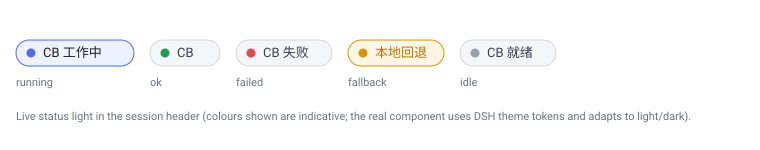

# codebuddy-first-bridge

**简体中文** · [English](README.en.md)

> 一个用于 **DeepSeek Harness (DSH)** 的 Cordis 插件：把编码/构建/调试/排查等实际工作**优先派发给本机的 `codebuddy` CLI**（腾讯 CodeBuddy Code），DSH 全程掌控 codebuddy（`--permission-mode bypassPermissions`，codebuddy 全程无提示），并在 **codebuddy 流量受限 / 网络不通** 时弹窗让用户选择是否回退到 **DSH 本地 API 配置**；同时在会话标题栏提供一个 **实时状态灯**，清晰显示 codebuddy 是否正在工作。



---

## 这是什么

`codebuddy-first-bridge` 给运行中的 DSH 会话注入两样东西：

1. **三个模型工具** —— `codebuddy_run`、`codebuddy_continue` 与 `codebuddy_status`，把任务转交给本机 `codebuddy` CLI 执行；
2. **一段 codebuddy 优先策略提示** —— 让模型在**所有模式**（普通 / plan / accept-edits / 子代理 / workflow / ralph / goal 轮次）下都优先调用 codebuddy 做实际工作，原生工具只用于只读查询和最终验证。

在此基础上，本插件还实现了用户要求的几项关键能力：

- **回退机制（弹窗确认）**：当 codebuddy 疑似被限流或网络不通时，自动弹出确认框，让用户选择「使用 DSH 本地 API 配置（回退）」/「重试 codebuddy 一次」/「不回退」。
- **实时状态灯（按项目，随软件启动）**：浏览器会话标题栏右侧的彩色指示灯**为每个项目（工作目录）分别显示一盏**，随该项目 codebuddy 活动实时变化（工作中 / 成功 / 失败 / 本地回退），悬停可查看该项目**当前正在执行的步骤**。状态灯是**家级插件**（[`home-plugin/codebuddy-indicator/`](home-plugin/codebuddy-indicator/)，经 `cordis.patch.yml` 注册），随 DSH 启动自动加载、所有会话自动显示、无需审批。
- **实时观察与用量统计（codebuddy_status）**：`codebuddy_status` 工具随时返回各项目 codebuddy 此刻在干什么 —— 每个项目当前步骤（工具名 + 参数或思考/打字中）、最近步骤轨迹、最近完成运行，以及**按项目累计的调用次数（runs）与 token 用量（totalTokens）**（codebuddy 无套餐额度 API，以 token 计量作替代观察）。支持 `cwd` 参数只看某个项目。运行中即可调用，无需等待结束。

## 四种形态

同一套逻辑提供四种落地形态，按需选择：

| 形态 | 位置 | 能力 | 是否随进程重启保留 | 状态灯 |
| --- | --- | --- | --- | --- |
| **持久 Agent Preset**（DSH 内推荐） | [`preset/codebuddy-first/`](preset/codebuddy-first/) | 工具 + 优先策略 + 回退弹窗 + `codebuddy_status` + 四后端（codebuddy/codebuddy-intl/codebuddy-en/workbuddy）+ 设置面板（偏好 CLI/默认模型/国际版凭据） | ✅ 是（落盘为 preset） | ❌ 无（Host 面组合不含浏览器 UI） |
| **家级状态灯插件**（随软件启动） | [`home-plugin/codebuddy-indicator/`](home-plugin/codebuddy-indicator/) | 状态灯（所有会话自动显示，无需审批） | ✅ 是（cordis.patch.yml 注册） | ✅ 有 |
| **动态 Cordis 插件**（当前会话） | [`dynamic/`](dynamic/) | 工具 + 优先策略 + 回退弹窗 + **状态灯** + `codebuddy_status` + 四后端 | ❌ 否（进程内临时） | ✅ 有（需一次性审批） |
| **MCP 服务器**（任何 MCP 宿主） | [`mcp/`](mcp/) | `codebuddy_run` / `codebuddy_continue` / `codebuddy_status` 通过 `tools/list` 被 Claude Code、Codex、Cherry Studio 等**自动发现**，由宿主代理自主决定是否调用；支持四后端 | ✅ 是（注册进客户端配置） | ❌ 无 |

> **状态灯为什么需要家级插件？** Agent Preset 是 **Host 面** 组合（`agent.cordis.yml` 挂载 Host 插件），其中的 `.mjs` 只在 Node 侧运行，天然不含浏览器 UI；而实时状态灯是 **Client 面**（浏览器 Slot）组件。**家级插件**（`cordis.patch.yml` 注册，如 `home-plugin/codebuddy-indicator/`）同时提供 Host 半（收集各会话推送的 codebuddy 状态 + HTTP 路由）与 Client 半（浏览器轮询渲染），随 DSH 启动自动加载、所有会话自动显示、无需审批。动态插件形态（首次运行需 GUI 一次性审批）与家级形态的灯可并存：两种形态都把快照汇入家级收集器（动态形态经 `codebuddyCollector.mergeSnapshot`，preset 形态经 `ctx.emit('codebuddy/status')` 事件）。
>
> 回退弹窗是 Host 侧能力，preset 与动态两种形态都具备；MCP 形态没有 UI，限流时改为在结果文本中附加「勿循环重试」提示，由调用方代理决定回退。

详见 [docs/ARCHITECTURE.md](docs/ARCHITECTURE.md)。

## 快速开始

### 方式 A：作为持久 Agent Preset 安装（推荐）

> **v1.2.0 起推荐方式 B 一并安装**（`dsh plugin --profile web add codebuddy-first-bridge`）：
> 方式 A 的注册通道已并入状态灯插件——新 DSH（≥ 0.1.7-alpha.1）上 preset 由 indicator 自动向
> `agentPresets` 注册表登记（声明制），旧 DSH（≤ 0.1.6-alpha.2）上沿用目录式安装。两种 DSH
> 都是装完方式 B 后开箱即用；下面的目录复制步骤仅旧 DSH 需要。

**方式 A1 — npm 安装（v1.1.6 起支持）**：

```powershell
npm install -g codebuddy-first-bridge
```

包内 `preset/codebuddy-first/` 即为完整 preset（含 `agent.cordis.yml`、`preset.yml` 与自包含的 bridge 模块）。把该目录复制到你的 DSH 用户 preset 根目录后即可选择（**仅 dsh ≤ 0.1.6-alpha.2 需要**；0.1.7-alpha.1 起目录式 preset 不再被读取，preset 由方式 B 的 indicator 插件自动注册）：

```powershell
$presetDir = (Get-ChildItem (npm root -g) -Recurse -Directory -Filter codebuddy-first | Select-Object -First 1).FullName
Copy-Item -Recurse "$presetDir" "$env:DSH_HOME\.agent-presets\codebuddy-first"
```

**方式 A2 — 从仓库复制**：

把 `preset/codebuddy-first/` 整个目录复制到你的 DSH 用户 preset 根目录下：

```
${DSH_HOME:-$HOME/.dsh}/.agent-presets/codebuddy-first/
```

Windows 示例（本仓库开发环境）：

```powershell
Copy-Item -Recurse .\preset\codebuddy-first "$env:DSH_HOME\.agent-presets\codebuddy-first"
```

然后新开一个 DSH 会话，选择名为 **`CodeBuddy-First 执行代理`**（id：`codebuddy-first`）的 preset 即可。它继承 `standard` preset 的全部能力，额外提供 `codebuddy_run` / `codebuddy_continue` / `codebuddy_status` 工具、codebuddy 优先策略与限流/网络回退弹窗。

> ⚠️ **不要**编辑随部署一起发行的 `agent-presets` 安装目录（升级会覆盖）。始终安装到用户 preset 根目录下的独立子目录。

完整步骤与校验方法见 [docs/INSTALL.md](docs/INSTALL.md)。

### 方式 B：安装家级状态灯插件（随软件启动、所有会话可见）

**标准安装（推荐，v1.1.7 起）**——家级灯已并入主包 `codebuddy-first-bridge`（`dsh.bundle.patch` 指向其 bundle 补丁层），一条命令即可：

```powershell
dsh plugin --profile web add codebuddy-first-bridge
```

DSH 插件系统安装主包后自动挂载家级灯：host 半经裸包名解析到 `main → lib/index.mjs`，client 半靠 `dsh.client` 声明自动纳入浏览器花名册，无需手动复制、无需 junction、无需改 `cordis.patch.yml`。

**旧式手动安装（留档）**：

```powershell
# 1) 复制插件源码
$dshHome = "$env:APPDATA\DSH Desktop\dsh-home"
Copy-Item -Recurse .\home-plugin\codebuddy-indicator "$dshHome\plugins\codebuddy-indicator"

# 2) 建 junction（host 解析与浏览器花名册都需要；共 3 条）
New-Item -ItemType Junction -Path "$dshHome\node_modules\codebuddy-indicator" -Target "$dshHome\plugins\codebuddy-indicator"
New-Item -ItemType Junction -Path "$dshHome\profiles\node_modules\codebuddy-indicator" -Target "$dshHome\plugins\codebuddy-indicator"
New-Item -ItemType Junction -Path "$dshHome\profiles\web\node_modules\codebuddy-indicator" -Target "$dshHome\plugins\codebuddy-indicator"

# 3) 在 cordis.patch.yml 追加一行（裸包名经 junction 解析到 lib/index.mjs）：
#    - insert:
#        - id: codebuddy-indicator
#          name: codebuddy-indicator
```

配合 **preset 形态**（方式 A）使用：preset 里的 `codebuddy-first-bridge.mjs` 每次状态变化会 `ctx.emit('codebuddy/status')` 推送到家级收集器，灯随之实时更新；改 `lib/index.mjs` 后重启 DSH 生效（或临时改成 `name: codebuddy-indicator?v=N` 热载），改 `lib/client.js` 后刷新浏览器即生效。

### 方式 C：作为动态 Cordis 插件运行（含状态灯）

在一个已加载 Cordis 能力的 DSH 会话里，用 `cordis_define` + `cordis_run` 定义并激活插件，Host 半用 [`dynamic/host.js`](dynamic/host.js)，Client 半用 [`dynamic/client.js`](dynamic/client.js)。首次运行 Client 半时，DSH GUI 会请求一次性审批，批准后状态灯即出现在会话标题栏。

### 方式 D：作为 MCP 服务器注册（任何 MCP 宿主可发现）

不需要 DSH 时，把 [`mcp/codebuddy-mcp-server.mjs`](mcp/codebuddy-mcp-server.mjs) 注册为 MCP 服务器，Claude Code / Codex / Cherry Studio 等宿主即可通过 `tools/list` 自动发现 `codebuddy_run` / `codebuddy_continue` / `codebuddy_status` 并自主决定调用：

```bash
# Claude Code 示例（路径换成你本机的仓库位置）
claude mcp add codebuddy -- node "<repo>/mcp/codebuddy-mcp-server.mjs"
```

Codex / 通用 JSON 配置、环境变量与自检见 [`mcp/README.md`](mcp/README.md)。

## 依赖前提

- **DeepSeek Harness (DSH)**，且会话已挂载所需 Host 服务：`tools`、`subprocess`、`systemPrompt`、`timer`（可选 `jobs`、`planMode`、`sandboxPolicy`、`userQuestions`）。
- 本机已安装 **`codebuddy` CLI**（CodeBuddy Code，`npm i -g @tencent-ai/codebuddy-code`；开发时验证版本 v2.143.0）。**不要求在 PATH 里**：桥接会依次尝试 `subprocess.resolveExecutable('codebuddy')` → `node + CODEBUDDY_BIN` → `node + %APPDATA%\npm\node_modules\@tencent-ai\codebuddy-code\bin\codebuddy`，npm 全局安装即可被找到。
- **可选**：腾讯 **WorkBuddy 桌面版**（办公任务 `backend="workbuddy"` 派发用；CLI 随桌面版安装于 `C:\Program Files\WorkBuddy\resources\app.asar.unpacked\cli\bin\codebuddy`，可用 `WORKBUDDY_BIN` 覆盖）。未安装时该后端返回带安装指引的错误，codebuddy 默认后端不受影响。
- **可选**：国际版账号。**两个国际面是两个独立选项（v1.4.0 起）**：
  - `backend="codebuddy-intl"`（显示名「**CodeBuddy 国际版（npm CLI · 国际面）**」，别名 `codebuddy-ioa` / `codebuddy-international` / `codebuddy-oversea`）：与 `codebuddy` 是**同一个 npm CLI**，走它的国际产品面（`product.ioa.json` 目录：`claude-sonnet-5`、`claude-opus-5`、`gemini-3.1-pro`、`gpt-6-astra`、`hy3-ioa` …）。**注意**：国际面模型由**服务端按账号授权**放行——真机实测 `--model claude-sonnet-5` 返回 `400 model [...] is only available for authorized users`，而 `--model hy4-preview`（国内面）正常返回 `PONG`。国内账号选它会拿到明确的授权错误提示，而不是配置错误。
  - `backend="codebuddy-en"`（显示名「**WorkBuddy 国际版（WorkBuddyAI 桌面 CLI）**」，别名 `workbuddy-en` / `workbuddy-ai`）：WorkBuddy 国际版是**独立安装包**——WorkBuddyAI 桌面版自带 CLI（`C:\Program Files\WorkBuddyAI\resources\app.asar.unpacked\cli\bin\codebuddy`，可用 `CODEBUDDY_EN_BIN` 覆盖；v1.3.0 曾误认为「复用同一个 npm CLI」，已由真机 product.json 推翻）。**凭据自动复用，通常无需配置**：国际版自己的登录 token 被桌面 App 的 protector key 加密，该密钥只经 sidecar 通道下发、**不落盘**，headless CLI 读不到（CLI 自身报 `category:"missing-key"`）；但桥接按 **设置面板 `codebuddyEnToken` → 环境变量 `CODEBUDDY_AUTH_TOKEN` → DSH 凭据库**（`dsh-home` 的 `.credentials.yaml` / `.env` 里指向 `workbuddy.ai/v2` 的 `WORKBUDDY_TOKEN`，即你为 DSH 的 workbuddy provider 配过的那个 key）依次取用。真机实测：只要 DSH 里配过 workbuddy key，`codebuddy-en` 即开箱可用；三条通道皆空时才返回 `AUTH_REQUIRED` + 指引，不会静默 401。办公场景也可直接用 `backend="workbuddy"`（国内版桌面 CLI，同样免配置）。
- **端点自动对齐（v1.3.1）**：桥接在每次调用前读取各产品面 auth 库的 `auth.domain`（明文），据此注入 `CODEBUDDY_BASE_URL` —— **仅当登录域与产品端点不一致时**。这修掉了默认后端 `codebuddy` 的既存缺陷：npm CLI 的产品端点是 `www.codebuddy.ai`，而本机登录 token 域是 `www.codebuddy.cn`，不注入覆盖必然 401。一般无需手工配置；确需覆盖时用设置项 `endpointOverride`。
- 状态灯还需 DSH 的 Web GUI（Client 面）。

## 工具用法

`codebuddy_run(prompt, mode?, model?, effort?, maxTurns?, cwd?, addDirs?, timeoutSec?, background?, backend?)`

- `backend`：**四后端选择**。`codebuddy`（默认，CodeBuddy 国内版 npm CLI，product 端点 `www.codebuddy.ai`，编码场景）、`codebuddy-intl`（= **CodeBuddy 国际版**，同一个 npm CLI 的国际产品面 `product.ioa.json`；别名 `codebuddy-ioa` / `codebuddy-international` / `codebuddy-oversea`；国际面模型由服务端按账号授权放行）、`codebuddy-en`（= **WorkBuddy 国际版**，WorkBuddyAI 桌面自带 CLI `C:\Program Files\WorkBuddyAI`，product 端点 `www.workbuddy.ai`，需填 `codebuddyEnToken`；亦接受别名 `workbuddy-en` / `workbuddy-ai`）、`workbuddy`（WorkBuddy 国内版桌面自带 CLI，product 端点 `copilot.tencent.com`，免配置；办公场景：文档/幻灯/表格、知识库、图片视频生成、微信/企微回复）。会话按后端归档（各产品面登录互斥）；`codebuddy_continue` 续接时按 sessionId **自动路由回所属后端**，显式传 `backend` 最优先；无历史会话的新调用按**用户偏好默认后端**（设置面板）调度。注意 `codebuddy-intl` 与 `codebuddy-en` 是**两个不同选项**：前者是 CodeBuddy 的国际面（同一 npm CLI），后者是 WorkBuddy 国际版（WorkBuddyAI 桌面 CLI）。
- `mode`：`auto`（默认，跟随 DSH plan 状态自动选 `plan`/`accept-edits`）、`plan`、`accept-edits`。
- `model`：可选，指定模型；不传时用**用户偏好默认模型**（设置面板，若设置过），否则用 CLI 配置的默认。**每个模型后方会挂倍率**（`hy3 · 免费`、`glm-5.3 · x0.79`），设置面板里还有「免费 ×N / 计费 / 未标倍率」三行一览，便于精确判断成本。倍率取自各安装 `product.json` 顶层 `models[].credits`（即界面上的 `0.00x`），**运行时读取**，升级 CLI 后重启即自动同步；`x0.00` 为免费，未标倍率表示该安装未提供该数据（**不等于免费**）。**两层决定：先看「哪个产品面提供该型号」，再看「账号是否授权」**（v1.4.1/v1.4.2 实测结论）。① 产品面决定**目录里有没有**这个型号——`codebuddy-en`（WorkBuddyAI）的目录里就没有 `hy4-preview` / `deepseek-v4.1-flash`；② 账号决定**目录里的能不能用**——`--help` 的静态表（`glm-5.2, kimi-k2.6, …`）对三个安装完全相同，但实际放行由账号授权决定。两种 400 要分清：`model [...] service info not found` = 该账号清单里没有这个 id；`model [...] is only available for authorized users` = 在清单里但你这个账号没授权。
  **要拿你这个账号的实时精确清单**，给 CLI 传一个故意不存在的 model，服务端会在报错里回一行 `Currently supported models for your account:` 后跟逐行 `  - <id>`（core 里的 `parseAccountModels()` 就是解析它的）。
  **先分清「哪个产品面提供」，再看账号授权**（v1.4.2）：三个免费模型（界面显示 `Free now` / `0.00x`）来自 **npm CLI 面**——`hy3` 与 `deepseek-v4.1-flash` 的 `credits` 实测为 `x0.00`，`hy4-preview` 为 `x0.29`（促销号常免费）；它们属于 `codebuddy` / `codebuddy-intl`，**不属于 WorkBuddyAI**。
 - `codebuddy` / `codebuddy-intl`：`hy4-preview`、`hy3`、`hy3-x`、`deepseek-v4.1-flash`、`glm-5.3`、`glm-5.3-flash`、`glm-5.2`、`glm-5.1`、`glm-5v-turbo`、`minimax-m3`、`minimax-m2.7`、`kimi-k3-1`、`kimi-k2.8-preview`、`kimi-k2.7`、`kimi-k2.6`、`deepseek-v4-pro`（下拉 = 该实测表在前，并入安装目录里多出的 id）。
 - `codebuddy-en`（WorkBuddyAI）：只有 `hy3` 一个免费模型；其余为 `gpt-5.1-codex-mini`、`gemini-3.1-flash-lite`、`gemini-2.5-flash`、`minimax-m3`、`gemini-3.0-flash`、`deepseek-v3-2-volc`、`kimi-k2.5/2.6`、`glm-5.0/5.2/5.3`、`gpt-5.3-codex`、`gpt-5.4/5.5`、`gpt-5.6-sol/terra/luna` 与 4 个角色别名。**该安装没有 `hy4-preview` 与 `deepseek-v4.1-flash`**，故不列出（v1.4.1 的并集逻辑会把它们混进来，v1.4.2 已改为严格只认自己安装的目录）。
 - `workbuddy`（国内桌面）：`auto`、`hy4-preview`、`hy3`、`hy3-x`、`deepseek-v4.1-flash`、`glm-5.x`、`kimi-k2.6/2.7/2.8-preview/k3-1`、`minimax-m3/m2.7`、`deepseek-v4-pro`；同样严格以自己安装目录为准。
 **注意**：`default-model` / `primary-model` / `gpt-6-astra` 一类是发行版内置候选，本机账号并不存在（实测报 `service info not found`），v1.4.0 曾误把它们当候选项。`effort`：`minimal / low / medium / high / xhigh / max`；`maxTurns`（1-500，默认不限）可选。
- `background: true`：作为后台任务运行，立即返回 `jobId`，用 `job_output` 收结果；后台路径同样有 `timeoutSec+60s` 挂起守卫。
- 返回：`{ ok, status, response, sessionId, durationSeconds, numTurns, totalTokens, exitCode, mode, backend, stderr }`；回退时为 `{ ok:false, fallback:true, status:'FALLBACK_TO_DSH', ... }`。

`codebuddy_continue(prompt, sessionId? | latest?, ...)` —— 复用某个会话上下文继续对话（`--resume <sessionId>` / `--continue`），其余参数同上；不带 `backend` 时按 sessionId 自动路由到该会话所属的 CLI。

`codebuddy_status(cwd?)` —— **实时观察 + 用量统计**：返回各项目 codebuddy 此刻在干什么（`{ state, running, current, trail, lastStatus, lastSessionId, runs, totalTokens, updatedAt, projects[] }`）。`projects[]` 按项目（工作目录）分节：`current` 为该项目当前正在执行的步骤（工具名 + 参数，或 thinking/typing 思考/打字中），`trail` 为最近步骤轨迹，`runs`/`totalTokens` 为**按项目累计的调用次数与 token 用量**（codebuddy 无套餐额度 API，以 token 计量作替代观察）。可选 `cwd` 只查某个项目。`codebuddy_run`/`codebuddy_continue` 运行期间即可调用，无需等待结束。

## DSH 完全控制 codebuddy

每次调用 codebuddy 都强制带 `-p`、`--output-format stream-json` 与 `--permission-mode bypassPermissions`（plan 模式则 `--permission-mode plan`），因此 **codebuddy 从不弹权限提示，改文件也不询问**；模式、模型、effort、工作目录、超时、是否后台、能否中止全部由 DSH 侧决定，可通过 `exec.signal` + `handle.terminate()` 取消。codebuddy 无 `--print-timeout`，超时由 DSH 侧挂起守卫兜底（`timeoutSec+60s` 强杀并报 `HUNG_TIMEOUT`）。`stream-json` 的每个事件（`assistant` 的 `tool_use`/`thinking`/`text`、`user` 的 `tool_result`）实时喂给 `codebuddy_status` 快照。

## 回退与状态灯

见 [docs/FALLBACK-AND-INDICATOR.md](docs/FALLBACK-AND-INDICATOR.md)。要点：

- 失败识别：非零退出，或 `stderr/status` 命中 `rate limit / 429 / quota / ECONN* / 网络 / 超时 / 限流 / 配额 …` 等特征（**只匹配 stderr 与 status**，不匹配回复全文——排查网络类任务的答复里几乎必现 connection/dns/timeout 字样，会误判限流；数字码带词边界，"1500" 不会命中 500）。
- 弹窗通过 DSH 的 `userQuestions.ask()` 实现；被子代理调用（无真人应答者）时自动跳过弹窗、按错误返回，避免永久阻塞。
- 每次限流/网络失败弹一次三选一；「重试」仅在还有重试次数（最多 2 次尝试）时提供；后台任务失败不弹窗（前台重跑才提示）。
- 状态灯每 1.2s 轮询家级插件暴露的 HTTP 路由 `GET /codebuddy-indicator/status`，颜色取自主题 token，自动适配明暗。

## 可视化配置界面（v1.3.2）

DSH 设置里新增「**CodeBuddy 桥接**」分区（浏览器半注册官方 `settings.section` 列表槽，与 dsh-dream-skin / dsh-mobile-companion 同款机制），四项用户偏好在同一面板编辑：

| 设置项 | 字段 | 说明 |
|---|---|---|
| 首选 CLI | `preferredBackend` | `codebuddy` / `codebuddy-intl` / `codebuddy-en` / `workbuddy` 下拉。只影响**缺省派发**；会话里显式传 `backend` 参数仍以参数为准 |
| 默认模型 | `defaultModel` | 输入框带所选后端的实测模型候选（datalist）。留空 = 各 CLI 自身默认 |
| 端点覆盖 | `endpointOverride` | 一般留空（按登录域自动推导）。仅调试用 |
| 国际版凭据 | `codebuddyEnToken` | 密码框，页面只显示尾 4 位掩码、明文永不回传浏览器；勾选「清除」可显式清空。留空保存 = 保持现值 |

面板下方是**逐后端诊断表**：每个后端的生效端点（含来源：覆盖 / 登录域 / product）、auth 库登录域、凭据来源（设置面板 / 环境变量 / DSH 凭据库自动复用）、可能 401 的警示与可操作提示。

**保存即对三种形态同时生效，无需重启**：面板经 `POST /codebuddy-indicator/settings` 写入 `<dsh-home>/codebuddy-bridge-settings.json`（单一事实源），preset 桥接、动态插件与 MCP 子进程在**每次调用时**现读该文件（MCP 有 5s 缓存）。优先级：设置文件 > preset 行 config > 默认值。

> 为什么不用 DSH 官方自动表单：官方 `Config` 投影只覆盖 `include` 条目，而 preset 桥接行经 `PresetTree` 组合挂载、不是 include → 永远进不了表单（`dsh-config-editor` 源码逐行核实）。自绘面板 + 自家读写路由是唯一能让一次保存抵达全部三形态的路径，且能展示诊断信息。

## 目录结构

```
codebuddy-first-bridge/
├─ README.md
├─ README.en.md
├─ LICENSE
├─ .gitignore
├─ package.json                 # 版本元数据（v1.1.0，Node ≥18）+ scripts（build/test/check）
├─ MCP-POLICY.md / MCP-POLICY.zh.md   # 外部代理「披露并优先」策略（安装到 ~/.claude/CLAUDE.md 与 ~/.codex/AGENTS.md）
├─ .github/workflows/ci.yml     # node --check + 测试套件 + 版本/YAML 结构校验（Node 18/20/22）
├─ assets/indicator-states.svg
├─ core/
│  └─ codebuddy-core.mjs        # ★ 共享核心（单一事实来源）：纯函数 + 状态引擎 + 行流 + 执行编排 + 文案
├─ scripts/
│  ├─ build.mjs                 # 生成派生产物（dynamic/host.js 文本注入 + preset 侧 core 副本）
│  └─ verify.mjs                # 版本四处锁死（package.json ↔ indicator package.json ↔ MCP VERSION ↔ CHANGELOG）+ YAML/结构断言
├─ test/                        # node:test 套件（125 例：纯函数/沙箱模拟/preset/MCP e2e/设置界面/同步锁定）
│  ├─ helpers/mockdsh.mjs       #   DSH 宿主形状替身（ctx/harness/subprocess/userQuestions）
│  ├─ fixtures/fake-codebuddy.mjs   #   伪 codebuddy CLI（MCP e2e 夹具）
│  └─ *.test.mjs
├─ preset/
│  └─ codebuddy-first/                 # 持久 Agent Preset（DSH 内推荐形态）
│     ├─ preset.yml              #   名称/描述
│     ├─ agent.cordis.yml        #   组合：standard + 一行 codebuddy 插件
│     ├─ codebuddy-first-bridge.mjs    #   宿主适配层（工具注册/事件发布/env 解析）
│     └─ codebuddy-core.mjs      #   【生成物】core 副本——preset 安装目录自包含
├─ home-plugin/
│  └─ codebuddy-indicator/             # 家级状态灯插件（随软件启动、所有会话可见）
│     ├─ package.json            #   dsh.client 声明（浏览器花名册）
│     └─ lib/
│        ├─ index.mjs            #   Host 半：收集 codebuddy/status 事件 + HTTP 路由（status + v1.3.2 settings GET/POST）
│        ├─ client-entry.mjs     #   裸名行占位入口（防二次加载 index.mjs 崩溃）
│        └─ client.js            #   浏览器半：轮询渲染每项目灯 + v1.3.2 可视化配置界面（settings.section）
├─ dynamic/                      # 动态 Cordis 插件形态
│  ├─ host.template.mjs          #   适配层模板（含 /*__CORE__*/ 注入点）
│  ├─ host.js                    #   【生成物】code.host 函数体（core 文本注入，勿手改）
│  └─ client.js                  #   code.client 函数体（空骨架：UI 由家级灯统一呈现）
├─ mcp/                          # MCP 服务器（任何 MCP 宿主可发现）
│  ├─ codebuddy-mcp-server.mjs         #   零依赖 stdio MCP 服务器（宿主适配层）
│  └─ README.md                  #   注册方法（Claude Code/Codex/DSH/通用）+ 安全护栏
└─ docs/
   ├─ INSTALL.md
   ├─ ARCHITECTURE.md
   ├─ FALLBACK-AND-INDICATOR.md
   ├─ CHANGELOG.md               # 版本历史（从 1.0.0 起）
   └─ en/                        # 英文文档
```

> **派生产物约定**：`dynamic/host.js` 与 `preset/codebuddy-first/codebuddy-core.mjs` 是生成物。修改共享逻辑改 `core/`，修改动态适配改 `host.template.mjs`，然后 `npm run build` 重新生成（`npm test` 的同步锁定会拦住忘记重生成的提交）。

## 兼容性与支持声明

对 npm 上**全部 26 个**已发布 `@deepseek-ai/dsh` 版本（0.0.1-rc.1 → 0.1.7-rc.1）做过探测/回测，完整矩阵与证据见 [docs/COMPATIBILITY.md](docs/COMPATIBILITY.md)。结论速览：

- **preset 形态（方式 A）**：**全版本可用（v1.2.0 修复）**——dsh ≤ 0.1.6-alpha.2 走目录制 preset（`dsh ≥ 0.1.3-alpha.2` 起强制 persona `prefix:`/`suffix:` schema）；dsh ≥ 0.1.7-alpha.1 起目录式 preset 不再被读取（目录制 → 声明制切换），preset 由状态灯插件（方式 B）向 `agentPresets` 注册表自动登记。**新 DSH 上方式 A 需与方式 B 一并安装**。
- **家级状态灯 bundle 安装（方式 B）**：`dsh plugin --profile web add codebuddy-first-bridge` **全 26 个版本可用**（plugin CLI / pnpm 转发 / `dsh.bundle.patch` / bundles 对账自 0.0.1-rc.1 即存在）。要求 `codebuddy-first-bridge ≥ 1.1.8`（1.1.7 的 client 注册 id 失配会在**所有** dsh 版本上触发启动致命屏）。
- **MCP server（方式 D）**：零依赖独立进程，与 dsh 版本无关。
- 新 dsh 版本发布后可用 `npm run compat:dsh` 重新回测（详见 [docs/RELEASE-SOP.md](docs/RELEASE-SOP.md) §3）。

## 版本与发布

版本管理遵循语义化版本（`package.json` + Git tag + GitHub Release；npm↔git 逐版本内容审计见 `npm run audit:npm`，CI 已接入）：

| 版本 | 适配 DSH | 内容 |
| --- | --- | --- |
| [v1.4.0](https://github.com/new-256/codebuddy-bridge/releases/tag/v1.4.0) | dsh 0.1.7-rc.1 真机实测 / 全版本 | **模型清单改为运行时读取 + CodeBuddy 国际版独立成选项**。用户反馈「四个产品面的模型获取错误」——逐安装核实属实：旧清单里 `codebuddy-en`/`workbuddy` 两份抄的是**国内版 `product.internal.json`**（含本机不存在的型号），`codebuddy` 一份也与 `--help` 不符。① 新增 `readBackendModelCatalog()`/`extractModelIds()`，**运行时**从各安装自己的 product 描述文件现读（`agents.cli.models` 与顶层 `models` 取更完整的那份——WorkBuddyAI 的 `agents.cli.models` 只有 4 个角色别名，37 个真实 id 在顶层 `models`），读不到回退内置实测清单，永不抛错/为空。实测项数：`codebuddy`=22、`codebuddy-intl`=53、`codebuddy-en`=37、`workbuddy`=23。② **新增后端 `codebuddy-intl`（CodeBuddy 国际版）**，与「WorkBuddy 国际版」（`codebuddy-en`）在面板上区分为两个独立选项：同一个 npm CLI 的国际面（`product.ioa.json`：`claude-sonnet-5`/`claude-opus-5`/`gemini-3.1-pro`/`gpt-6-astra`/`hy3-ioa`…），别名 `codebuddy-ioa`/`codebuddy-international`/`codebuddy-oversea` 归一；规范 id 只增不改（历史会话归档键不变）。③ **实测结论**：国际面模型被同一个 npm CLI 接受，但由**服务端按账号授权**放行——`--model claude-sonnet-5` 返回 `400 model [...] is only available for authorized users`，`--model hy4-preview` 返回 PONG；`codebuddy-intl` 诊断提示专述此点，避免误改端点/凭据。④ policy 文案、六处 schema `enum`/描述、面板模型提示同步。测试 128→132 例 |
| [v1.5.0](https://github.com/new-256/codebuddy-bridge/releases/tag/v1.5.0) | dsh 0.1.7-rc.1 真机实测 / 全版本 | **每个模型后面挂上倍率，能精确判断成本**。CLI 的 `--help` 只印 id、没有倍率子命令；倍率在**各安装 `product.json` 顶层 `models[].credits`**（即界面那个 `0.00x`；`agents.cli.models` 只是字符串数组不带倍率）。① 新增 `extractModelCredits` / `parseCreditValue`：只认 `x<数字>`，**`0`（免费）与 `null`（未标）严格区分**，绝不把缺失猜成免费。② 新增 `modelCatalogDetailed()`：`{id,credits,free,label}`，label 形如 `hy3 · 免费` / `glm-5.3 · x0.79`；**有倍率的在前并按升序**，免费自然浮到最前。③ 面板下拉用 label，并加**倍率一览**（免费 ×N / 计费 / 未标倍率三行）。④ **同步方式：运行时读 product 描述文件**——升级 CLI 后重启即自动更新，无需改插件。⑤ policy 与六处 schema 加入成本指引。另加一道**引号状态机守卫**，专防「单引号串里写英文所有格裸撇号」这个在 v1.4.1/1.4.2/1.5.0 各踩一次的坑。测试 136→144 |
| [v1.4.2](https://github.com/new-256/codebuddy-bridge/releases/tag/v1.4.2) | dsh 0.1.7-rc.1 真机实测 / 全版本 | **「哪个产品面提供哪些模型」搞清楚了**。你反馈 WorkBuddy 国际版界面有 `Hy4 preview` / `Hy3` / `Deepseek-V4.1-Flash` 三个 **Free now（0.00x）** 却不在列表里。读 `product.json` 的 `credits` 字段实测：`hy3` 与 `deepseek-v4.1-flash` 为 `x0.00`（免费）、`hy4-preview` 为 `x0.29`，这三个是 **npm CLI 面**（`codebuddy`/`codebuddy-intl`）的目录——**WorkBuddyAI 的目录里根本没有 `hy4-preview` 与 `deepseek-v4.1-flash`**，它只有 `hy3` 一个免费模型。① 新增 `BACKEND_STRICT_CATALOG`：两个桌面后端（`codebuddy-en`/`workbuddy`）**严格只认自己安装的目录**，不再与静态表并集——v1.4.1 的并集会把 npm 面型号泄漏给桌面版，用户选了必然报错；npm 面保持并集。② `codebuddy-en` 静态回退表按 `credits` **免费优先**重写（首项 `hy3`），移除该安装没有的两个型号。③ policy 改为「先分产品面、再看账号授权」。测试 134→136 |
| [v1.4.1](https://github.com/new-256/codebuddy-bridge/releases/tag/v1.4.1) | dsh 0.1.7-rc.1 真机实测 / 全版本 | **模型清单的权威来源找对了：按账号，不按安装**。你指出「分清楚 codebuddy 与 workbuddy 的模型」——**确实有误，且 v1.4.0 的整个思路就是错的**。① v1.4.0 认为 product.json 是权威清单，真机把那些 id 逐个喂给 CLI 实测后发现大量不存在：`default-model`/`primary-model`/`gpt-6-astra` 均报 `400 model [...] service info not found`。它是**发行版内置候选表**，不等于**账号可用表**；且 `--help` 静态表对三个安装**完全相同**，说明差异在账号不在安装。② 真正的权威来源：传一个不存在的 model，服务端回 `Currently supported models for your account:` + 逐行 `- <id>`，按账号实时。新增 `parseAccountModels()` 解析它。③ **优先级反转**：`backendModelCatalog()` 改为静态表（= 账号实测）为主、product 文件只做并集补充（v1.4.0 反了）。④ 修正 `workbuddy` 读错文件：原用 `product.cloudhosted.json`（endpoint 与 auth.id **均为空**，只是变体碎片），改正为该安装真正的产品面 `product.json`（`applicationName=WorkBuddy`、`auth.id=workbuddy-desktop`）。⑤ policy 模型段重写，写明两种 400 的区分。测试 132→134 |
| [v1.3.3](https://github.com/new-256/codebuddy-bridge/releases/tag/v1.3.3) | dsh 0.1.7-rc.1 真机实测 / 全版本 | **WorkBuddy 国际版正名 + 后端别名**。核实 `C:\Program Files\WorkBuddyAI`（WorkBuddy 国际版）自 v1.3.1 起即已接入 = `codebuddy-en` 后端，旧标签「CodeBuddy 国际版」造成「未加入」误解。显示名改为「WorkBuddy 国际版（WorkBuddyAI 桌面 CLI）」；`backend="workbuddy-en"` / `"workbuddy-ai"` 别名归一到规范 id `codebuddy-en`（normalizeBackend + BACKEND_ALIASES，三优先级通道与设置文件清洗全覆盖，历史会话归档不受影响）；policy 文案清除 v1.3.0 时代错误说法。测试 125→128 例 |
| [v1.3.2](https://github.com/new-256/codebuddy-bridge/releases/tag/v1.3.2) | dsh 0.1.7-rc.1 真机实测 / 全版本 | **可视化配置界面**。DSH 设置新增「CodeBuddy 桥接」分区（自绘 settings.section，官方 Config 表单对 preset 桥接行不可达）：首选 CLI / 默认模型 / 端点覆盖 / 国际版凭据（掩码显示、明文不回传）+ 逐后端生效诊断（登录域→端点→凭据来源→401 警示）。单一事实源 `<dsh-home>/codebuddy-bridge-settings.json`（core 原语 + indicator GET/POST 路由），preset/动态/MCP 三形态**每次调用现读 → 保存即生效无需重启**；deploy.mjs 同步 dsh-home 的 core+bin 副本。测试 +14 例至 125 例，verify 新增版本齐步/结构闸门 |
| [v1.3.1](https://github.com/new-256/codebuddy-bridge/releases/tag/v1.3.1) | dsh 0.1.7-rc.1 真机实测 / 全版本（设置面兼容矩阵见 [COMPATIBILITY](docs/COMPATIBILITY.md)） | **端点与凭据根因修复**（推翻 v1.3.0 的国际版机制结论）。① **三后端各有独立安装包**（真机 `product.json` 核实）：`codebuddy`=npm `@tencent-ai/codebuddy-code`（CodeBuddy，端点 `www.codebuddy.ai`）、`codebuddy-en`=`C:\Program Files\WorkBuddyAI\...`（WorkBuddy AI，`www.workbuddy.ai`）、`workbuddy`=`C:\Program Files\WorkBuddy\...`（WorkBuddy，`copilot.tencent.com`）。② **修掉默认后端 codebuddy 的既存 401**：npm CLI 的 product 端点是 `www.codebuddy.ai` 而登录 token 域是 `www.codebuddy.cn`，域不匹配必然 401（用户日志 312 次 `www.codebuddy.ai` + 116 次 `Authentication required` 的根因）；真机验证注入 `CODEBUDDY_BASE_URL=https://www.codebuddy.cn/v2` 后 `codebuddy`/`workbuddy` 双双返回 PONG。③ **端点按登录域自动对齐**：新增 `resolveEndpoint()`/`endpointEnv()`/`endpointMismatchHint()` 与 `BACKEND_ENDPOINTS`/`AUTH_DOMAIN_ENDPOINTS`/`BACKEND_AUTH_IDS`（取代 `intlEndpointEnv`），宿主侧读 auth 库**明文** `auth.domain`，**仅当与 product 端点不同才注入**；删除语义错误的 `CODEBUDDY_INTERNET_ENVIROMENT=cloudhosted`（`www.workbuddy.ai` 属 `externalDomain`）。④ **`codebuddy-en` 凭据三通道（开箱即用）**：国际 token 被 protector key 封装且密钥不落盘（全盘 51612 文件扫描 + 全部 DPAPI blob 解包零命中；CLI 自身报 `category:"missing-key"` ×21），但**用户通常已在 DSH 里配好同一个 token**（provider 配置指向 `workbuddy.ai/v2` 的 `WORKBUDDY_TOKEN`）——真机实测该 token 下发给 WorkBuddyAI CLI 即返回 PONG。故新增 `resolveEnToken()`：设置面板 `codebuddyEnToken` → 环境变量 `CODEBUDDY_AUTH_TOKEN` → **DSH 凭据库**依次取用，`codebuddy-en` 无需手工配置；三通道皆空才 `AUTH_REQUIRED` + 可操作指引（不再静默 401）。`codebuddyEnBaseUrl` 移除（默认值本身错误），改为 `endpointOverride`。测试 100→111 例全绿 |
| [v1.3.0](https://github.com/new-256/codebuddy-bridge/releases/tag/v1.3.0) | dsh 0.1.7-rc.1 真机实测 / 全版本（设置面兼容矩阵见 [COMPATIBILITY](docs/COMPATIBILITY.md)） | **CodeBuddy 国际版接入 + 插件设置**。① 三后端：新增 `codebuddy-en`（国际版 CodeBuddy）——~~国际版没有独立 npm 包，就是同一个 `@tencent-ai/codebuddy-code` CLI + 端点切换~~（**该结论已被 v1.3.1 真机推翻**，见上）；端点注入变量 `CODEBUDDY_BASE_URL=https://www.workbuddy.ai/v2` 与 `CODEBUDDY_INTERNET_ENVIROMENT=cloudhosted`（**均已移除**：前者默认值对默认后端是错的，后者语义错误）。后端路由统一为 `resolveBackend()`（显式 > 会话归属 > 用户偏好 > 默认），三形态六处工具 schema 与策略提示同步扩列，模型清单按产品面分列（两列表来自两个已装 CLI `--help` 实测）。② 插件设置（设置面板）：桥接行导出 `Config` 鸭子 schema（preset 沙箱无法 import schemastery；`toJSON()` 产出官方 refs JSON 可被官方 `z()` 原样重建，SettingsForms 投影契约逐函数核实），字段全 volatile 热编辑；旧 DSH（≤0.1.6）`ctx.settings` provider 鸭子探测 + watch 热同步，服务缺失静默降级为行 config；MCP/动态形态共享 dsh-home 根 `codebuddy-bridge-settings.json`。测试 85→100 例 |
| [v1.2.0](https://github.com/new-256/codebuddy-bridge/releases/tag/v1.2.0) | dsh 0.1.7-rc.1 真机实测 / 全版本（26 版本矩阵） | **Form-A 修复：新 DSH（≥ 0.1.7-alpha.1）preset 静默失效**——dsh 0.1.7-alpha.1 起 preset 从目录制（`.agent-presets/`）切为**声明制**（运行时向 `agentPresets` 注册表登记），旧目录不再被读取，方式 A 装上即失效且无报错。修复 = **indicator 自注册声明**：状态灯插件 `apply()` 里 `ctx.inject(['agentPresets'])` 等注册表出现后 `register(definition)`（官方 standard preset 全量移植 + 桥接行；旧 DSH 上注入器挂起零副作用，不新增任何 loader 行——旧 loader 对导入失败是致命的）。桥接行用裸说明符子路径 `codebuddy-first-bridge/preset-bridge`（注册表以自身 baseUrl 解析相对名，相对路径必然指错）。真机验证：本地 tarball 走真实 `dsh plugin add` 安装 + boot，roster 探针确认 `codebuddy-first` 与官方四个 preset 并列、无 broken。兼容矩阵 22 → 26 版本（新增 C8 声明制契约探针 + 0.1.5-rc.3 / 0.1.7-alpha.1/.2 / 0.1.7-rc.1） |
| [v1.1.12](https://github.com/new-256/codebuddy-bridge/releases/tag/v1.1.12) | 见支持声明（22 版本回测） | **工程化修补：dsh 全版本回测基线修复 + 矩阵扩展至 22 版本**（不涉及插件运行时行为）——① 移除 `--legacy-peer-deps`（会跳过 dsh-app-boot 运行时必需的 peerDependencies，导致沙箱 dsh 环境缺 peer 无法 boot）；② 加 `--before=<发布时间>` 时间锚定（防内部组件 caret 范围把 0.1.6-alpha.x 拉进历史版本形成混合树）；③ `PROBE_VER` 对齐 1.1.11。`docs/COMPATIBILITY.md` 新增 0.1.6-alpha.1/.2 两行并重跑矩阵 |
| [v1.1.11](https://github.com/new-256/codebuddy-bridge/releases/tag/v1.1.11) | 见支持声明（全版本回测） | **工程化修补：两个发布/回测工具的观测准确性**（不涉及插件运行时行为）——① `audit-npm-sync.mjs` 取版本列表加 `--prefer-online`：`npm view <pkg> versions` 会命中 npm 本地元数据缓存，导致刚 `npm publish` 完立刻审计仍只见旧版本列表（实测；CI 新 tag 刚推时同理）；② `dsh-compat.mjs` 汇总单列 **功能失败**：此前 `functional.ok === false` 的真实失败被算进 `untested`，与「根本没跑过」混为一谈（20 版本回测中 7 个「CLI 环境不兼容」行口径不准），现在 `untested = 总数 − pass − failed − skip − pending` 并与 COMPATIBILITY §3.1 分档对齐 |
| [v1.1.10](https://github.com/new-256/codebuddy-bridge/releases/tag/v1.1.10) | 见支持声明（全版本回测） | **工程化：一致性审计 + 全版本回测 + 支持声明 + 交接文档**：新增 `audit-npm-sync.mjs`（npm 每个已发布版本 ↔ git tag 树逐文件 sha256 比对，`git -c core.autocrlf=false` 取原始字节；审计结论 1.1.6–1.1.9 内容零漂移）与 `dsh-compat.mjs`（20 个 dsh 版本 7 契约点静态探测 + 沙箱真实安装回测）；`docs/COMPATIBILITY.md` 支持声明、`docs/RELEASE-SOP.md` 发布维护 SOP、`docs/HANDOVER.md` 交接文档；CI 增 npm↔git audit job；CRLF 归一化 + `.gitattributes`（`* text=auto eol=lf`），1.1.10 起 tarball 与 tag 字节级一致 |
| [v1.1.9](https://github.com/new-256/codebuddy-bridge/releases/tag/v1.1.9) | dsh 0.1.5-rc.1 实测 / 0.1.2-alpha.4+ | **发布闸门加固（防 v1.1.8 事故复发）**：`verify.mjs` 新增 client 注册 id 静态检查——从 `exports["./client"]` 解析 client 文件、提取 `__ModuleLoader__.load({ id })`，**强制其与包名 `codebuddy-first-bridge` 严格一致**（id 不匹配会触发 client-modules 的 `loaded without registering "<packageName>"`，整个 combo 崩屏）；`prepack` 加强为 `verify + npm test`，发布前跑完整测试套件，热修时的版本断言漂移也不再可能漏到 npm |
| [v1.1.8](https://github.com/new-256/codebuddy-bridge/releases/tag/v1.1.8) | dsh 0.1.5-rc.1 实测 / 0.1.2-alpha.4+ | **紧急修复 DSH 启动致命屏**：v1.1.7 并入主包后 client.js 的 `__ModuleLoader__.load` 仍写旧独立包名 `id: "codebuddy-indicator"`，与 graph row 以包名注册的 id 不匹配 → client-modules 校验失败 → 整个 client combo 崩溃（`Failed to load plugins`，桌面壳进入安全模式）。id 改为 `codebuddy-first-bridge` |
| [v1.1.7](https://github.com/new-256/codebuddy-bridge/releases/tag/v1.1.7) | dsh 0.1.3-alpha.2+ / Desktop 0.3.4+ | **家级状态灯改为标准 npm 分发形态**（对齐 agy-first-bridge v1.6.0）：主包 `main` 直指 `home-plugin/codebuddy-indicator/lib/index.mjs`（host 真入口）、`dsh.client.platform: web`（client 半自动纳入花名册）、`dsh.bundle.patch`（安装后自动挂载家级灯）、`bin.codebuddy-mcp-server`；新增 bundle 补丁层，家级灯由裸包名一行加载——不再有 `file://` 行、不再有 client-entry 占位，单实例无二次注册崩溃风险。本机用户层 `cordis.patch.yml` 同步由 `file://...?v=6` 改为裸包名。跨设备安装：`dsh plugin --profile web add codebuddy-first-bridge` |
| [v1.1.6](https://github.com/new-256/codebuddy-bridge/releases/tag/v1.1.6) | dsh 0.1.3-alpha.2（`@deepseek-ai/dsh-persona` 0.1.3-alpha.2 起） | **适配 dsh-persona 配置校验升级**：后端自动更新至 0.1.3-alpha.2 后，官方 `@deepseek-ai/dsh-persona` 将 Schemastery schema 由旧 `text:` 强制升级为 `prefix: z.string().required()` + `suffix: z.string().default("")`，旧结构被校验器拒绝挂载（恢复会话抛 `invalid config: - $.prefix missing required value`）。persona 行迁移为 `prefix:` + `suffix:` 拆分（与官方 standard preset 写法一致）；`verify.mjs` 新增防回归护栏（禁残留 `text:`、要求 `prefix:`/`suffix:`）；并开放 **npm 发布**（去 `private`、`files` 白名单补 README/LICENSE、`prepack` 发布前强制全量校验），`npm install -g codebuddy-first-bridge` 即可安装 |
| [v1.1.5](https://github.com/new-256/codebuddy-bridge/releases/tag/v1.1.5) | Desktop 0.3.4+（实测 0.3.14）/ dsh 0.1.2-alpha.4+ | **修复状态灯对标准模式完全失明**：标准（非 codebuddy-first）模式经**全局 MCP 行**调用，而 MCP 是独立子进程 —— 没有 `ctx.emit`、拿不到 `codebuddyCollector` 服务、`createStatusEngine(null)` 直接关掉 publish，家级插件从来收不到任何数据，灯在整个调用过程中不出现。改用**文件通道**（MCP 原子写 `<dsh-home>/codebuddy-indicator-mcp.json`，插件响应请求时读取合并；两端从自身模块位置推导路径，不需要端口 —— `webServer.register` 不暴露端口且端口实测会变）。修好通道后又发现活动明细仍全空：`child.stdout` 未声明编码 → `'data'` 给的是 `Buffer` → `pushChunk` 静默丢弃 → `foldEvent` 从不触发（而 tokens/session 全正常，因为 result 是从累积字符串解析的），补 `setEncoding('utf8')`。另修状态输出里的希腊字母 `Σ` → `total`。实测：端点全程 `state=running`，明细推进到 `cur=Bash#6`、trail 1→12。测试 68→73 例 |
| [v1.1.4](https://github.com/new-256/codebuddy-bridge/releases/tag/v1.1.4) | Desktop 0.3.4+（实测 0.3.14）/ dsh 0.1.2-alpha.4+ | **修复标准模式调用不顺畅**：codebuddy CLI 自报的 `error_during_execution` 瞬时故障此前既不重试、也**不给任何原因**（失败只回一行 head），调用方只能白耗一次 `codebuddy_status` 再靠猜换 `model` 才成功。实测同一任务同一默认模型（`hy4-preview`）重跑即过，证实是 CLI/服务端瞬时故障而非模型或任务问题。现在：① 瞬时错误**静默自动重试一次**（preset 与 MCP 两条路径；与限流/网络类分流——后者仍问用户，重试可能纯烧钱；续接类调用不自动重试）；② 失败**必带可行动指引**（该重试 / 该换模型 / 该改用原生工具）；③ 结果 head 记录**实际使用的模型** `model=…` 与 `retried=1`，排查默认模型不必再靠猜。测试 66→68 例 |
| [v1.1.3](https://github.com/new-256/codebuddy-bridge/releases/tag/v1.1.3) | Desktop 0.3.4+（实测 0.3.14）/ dsh 0.1.2-alpha.4+ | **修复两处**：① **计划模式 Bash 门禁**——DSH 计划模式下 CLI 在 `-p` 非交互 + `plan` 下默认拒绝 Bash，codebuddy 报「Bash 工具在无交互模式下未获授权（被拒绝），所以我改用 PowerShell」，门禁不一致导致白耗回合甚至放弃调查；plan 模式改为额外 `--allowedTools Bash` **预批**只读 shell，实测 Bash 恢复可用而**写入仍被 plan 独立禁止**（只读保证完好），`Read`/`Grep` 不受影响。② **状态灯会话判定改为 host 侧实时枚举**——不再依赖 DSH 客户端摘要的 `agentPreset`（默认会话根本没这个字段 → 判「未知」→ 回退全局租约 → 普通会话仍亮灯；且字段位置随 DSH 版本漂移）：家级插件用 `agents.list()` + `agentPresets.composedPreset()` 现算 codebuddy-first 会话名单并由端点返回，**对已开会话立即生效**；客户端与摘要通道构成「任一肯定即肯定」的双通道安全阀（失配时退化为不亮，而非永久不亮）；preset 上报 sessionId 作兜底，会话关闭立即熄灯。测试 58→66 例 |
| [v1.1.2](https://github.com/new-256/codebuddy-bridge/releases/tag/v1.1.2) | Desktop 0.3.4+（实测 0.3.5 与 0.3.14）/ dsh 0.1.2-alpha.4+ | **适配 DSH Desktop 0.3.14 / dsh 0.1.2-alpha.5**。DSH 插件体系重构后客户端会话摘要的 `agentPreset` 移入 `projectionValues` 投影值、槽位 `inject` 改零参调用，v1.1.1 的会话级就绪灯判定失效（回归为全局灯）；修复为**双通道**：优先框架标准 props（`sessionId` + `useSessions` 钩子，读 `projectionValues.agentPreset`），回退旧式 `inject(sessionId)` + `sessions.list` 快照，两通道同时认新旧摘要形状；家级插件 package.json 声明 `dsh.compat`（desktop/backend/verified）；README 版本表增「适配 DSH」列、历史 Release 补标 DSH 版本；combo 花名册 + HMR 内容指纹逐字节实测命中 |
| [v1.1.1](https://github.com/new-256/codebuddy-bridge/releases/tag/v1.1.1) | Desktop 0.3.5 开发验证；0.3.14 实测兼容（客户端判定通道需 v1.1.2） | **修复：非 codebuddy-first 会话状态灯常驻**（两层原因都修）：① 家级插件 `presetActive` 原为粘滞标志——DSH 启动后只要有任何会话加载过一次 codebuddy-first preset，之后所有会话都常驻「CB 就绪」灯；改为**心跳租约**（preset 每 30s 宣告续期、TTL 75s、`active:false` 立即熄灭），最后一个 codebuddy-first 会话关闭后 ≤75s 自动熄灭。② 「CB 就绪」空转灯从全局改为**会话级**——客户端从 `sessions.list` 快照读本会话 `agentPreset` 本地判定，只在该会话本身是 codebuddy-first 时显示，活动灯（项目 pill）保持全局；host 半抽取为可测的 `createIndicatorState()` 并首获测试覆盖。测试 49→58 例 |
| [v1.1.0](https://github.com/new-256/codebuddy-bridge/releases/tag/v1.1.0) | Desktop 0.3.5 | **双后端：WorkBuddy 接入**。`backend="workbuddy"` 把办公任务（文档/幻灯/表格、知识库、图片视频生成、微信/企微回复）派发给腾讯 WorkBuddy——CodeBuddy 的**同引擎孪生 CLI**（同一 stream-json 协议，实测逐字段兼容），登录态随桌面应用共享。**会话感知后端路由**：两 CLI 各自维护会话存储，续接时按 sessionId 自动路由回所属 CLI；结果带 `backend` 字段、状态带 `[workbuddy]` 标记；MCP 未装 WorkBuddy 时返回带安装指引的错误。测试套件扩至 49 例 |
| [v1.0.0](https://github.com/new-256/codebuddy-bridge/releases/tag/v1.0.0) | Desktop 0.3.5 | **首个正式版本**：`codebuddy_run` / `codebuddy_continue` / `codebuddy_status` 三工具 + codebuddy 优先策略 + 受限回退弹窗 + 家级实时状态灯 + 动态形态 + 零依赖 MCP 服务器（含 `CODEBUDDY_MCP_ALLOWED_ROOTS` 白名单护栏）+ 按项目 token 用量统计（codebuddy 无套餐额度 API，以 token 计量替代）+ 指定 `model`/`effort`/`maxTurns`；`core/` 共享核心（单一事实来源 + 生成派生产物 + 同步锁定）；可靠性基线（全失败路径可用、会话感知 cwd 回落、单次弹窗、后台挂起守卫、限流判定收窄、跨 chunk 半行安全解析）由 44 例故障注入回归测试锁定，CI 语法矩阵 + 测试 + 版本三处锁死 |

详见 [docs/CHANGELOG.md](docs/CHANGELOG.md)。

## 安全说明

- `--permission-mode bypassPermissions` 表示 codebuddy 会在不再询问的情况下改动文件、执行命令。这是「DSH 完全控制 codebuddy」这一需求的直接实现，请仅在你信任 codebuddy 执行环境时使用。MCP 形态可用 `CODEBUDDY_MCP_ALLOWED_ROOTS` 限定允许的工作目录白名单（见 [`mcp/README.md`](mcp/README.md)）。
- 插件只向 Host 的 `tools` / `systemPrompt` 注册、并暴露一个包私有的 `codebuddy_status` 只读 JSON 方法，不发布任何跨会话服务，因此可安全放入 preset 面（无需 isolate realm）。
- 所有副作用（工具注册、提示段、样式、定时器）都通过 `ctx.effect` / `ctx.tools.register` / `ctx.timeout` 挂到当前 Fiber，插件停止/更新/卸载时自动清理。

---

## English summary

`codebuddy-first-bridge` is a Cordis plugin for the **DeepSeek Harness (DSH)**. It registers model tools (`codebuddy_run`, `codebuddy_continue`, `codebuddy_status`) that dispatch real work to the local **`codebuddy` CLI** (Tencent CodeBuddy Code) under full DSH control (`--permission-mode bypassPermissions`, so codebuddy never prompts), and injects a *codebuddy-first* policy so the model prefers codebuddy across every mode. When codebuddy is **rate-limited or the network is down**, it pops a confirmation dialog offering the **DSH local API config** as a fallback, and it renders a **live status light** in the session header showing whether codebuddy is currently working.

Four forms are shipped: a **persistent agent preset** (`preset/codebuddy-first/`, survives restart, host-side fallback included), a **home-level status-light plugin** (`home-plugin/codebuddy-indicator/`, registered via `cordis.patch.yml`, the light appears in every session with no approval), a **dynamic Cordis plugin** (`dynamic/`, adds the browser status light, needs a one-time approval), and [`mcp/`](mcp/), a zero-dependency **MCP server** that exposes `codebuddy_run` / `codebuddy_continue` to *any* MCP-capable host (Claude Code, Codex, Cherry Studio, …), where the agent discovers the tools itself and decides when to call them — even without any codebuddy-first preset.

👉 **Full English documentation: [README.en.md](README.en.md)** — with English guides under [`docs/en/`](docs/en/) (install, architecture, fallback & indicator).

## License

[MIT](LICENSE) © 2026 chenglong
